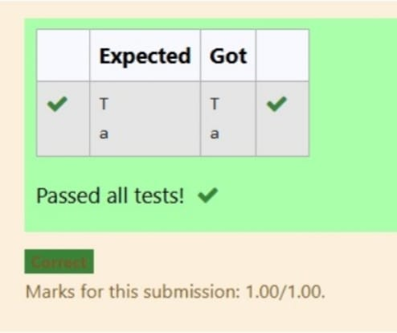

# Datatypes-Character Literal in Python

## 🎯 Aim
To write a Python program that prints the characters `'T'` and `'a'` using character literals.

## 🧠 Algorithm
1. Print the character `'T'`.
2. Print the character `'a'`.

## 🧾 Program
print("T")
print("a")

## Output

## Result
A Python program that prints the characters `'T'` and `'a'` using character literals was completed successfully and output was generated.